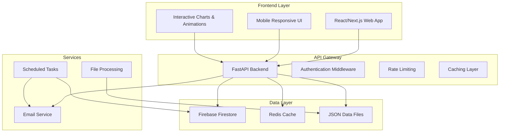

# Design Document

## Overview

این سند طراحی یک وب اپلیکیشن جامع برای نمایش و مدیریت استراتژی‌های سرمایه‌گذاری در بازار بورس ایران را ارائه می‌دهد. سیستم شامل یک فرانت‌اند تعاملی با React/Next.js، یک بک‌اند API با FastAPI، سیستم احراز هویت، دیتابیس برای ذخیره‌سازی داده‌ها و سیستم اطلاع‌رسانی خودکار است.

## Architecture

### High-Level Architecture



### Technology Stack

**Frontend:**
- Framework: Next.js 14 with App Router
- UI Library: React 18
- Styling: Tailwind CSS + Framer Motion
- Charts: Chart.js / Recharts
- State Management: Zustand
- HTTP Client: Axios

**Backend:**
- Framework: FastAPI
- Authentication: Firebase Auth
- Database: Firebase Firestore
- Cache: Redis
- Email: SendGrid
- Scheduling: APScheduler
- Environment: Python 3.11+

**Infrastructure:**
- Hosting: Vercel (Frontend) + Railway/Render (Backend)
- Database: Firebase Firestore
- Cache: Redis Cloud
- Email: SendGrid
- Monitoring: Sentry

## Components and Interfaces

### Frontend Components

#### 1. Strategy Selection Page Components

```typescript
// Main strategy selection page
interface StrategySelectionPage {
  strategies: Strategy[]
  selectedStrategy: string | null
  onStrategySelect: (strategyId: string) => void
  onProceed: () => void
}

// Individual strategy card
interface StrategyCard {
  strategy: Strategy
  isSelected: boolean
  isHovered: boolean
  onClick: () => void
  onHover: (hovered: boolean) => void
}

// Strategy data structure
interface Strategy {
  id: 'defensive' | 'balanced' | 'aggressive'
  name: string
  icon: string
  tagline: string
  story: string
  factors: {
    value: number
    momentum: number
    lowVolatility: number
  }
  callToAction: string
  theme: {
    primaryColor: string
    secondaryColor: string
    backgroundImage: string
  }
}
```

#### 2. Results Dashboard Components

```typescript
// Main results dashboard
interface ResultsDashboard {
  strategy: Strategy
  portfolioData: PortfolioData
  performanceData: PerformanceData
  backtestData: BacktestData
}

// KPI cards component
interface KPICards {
  annualReturn: number
  annualRisk: number
  sharpeRatio: number
  alpha: number
}

// Portfolio composition
interface PortfolioComposition {
  holdings: Holding[]
  chartType: 'pie' | 'donut'
}

interface Holding {
  symbol: string
  name: string
  weight: number
  sector?: string
}

// Performance chart
interface PerformanceChart {
  data: ChartDataPoint[]
  benchmarkData: ChartDataPoint[]
  timeRange: '1Y' | '3Y' | '5Y'
}
```

#### 3. User Management Components

```typescript
// Authentication components
interface AuthForm {
  mode: 'login' | 'signup'
  onSubmit: (credentials: UserCredentials) => void
  loading: boolean
  error?: string
}

interface UserCredentials {
  email: string
  password: string
}

// User dashboard
interface UserDashboard {
  user: User
  portfolios: Portfolio[]
  notifications: Notification[]
}
```

### Backend API Endpoints

#### 1. Authentication Endpoints

```python
# User authentication
@router.post("/auth/signup")
async def signup(user_data: UserSignup) -> AuthResponse

@router.post("/auth/login") 
async def login(credentials: UserLogin) -> AuthResponse

@router.post("/auth/logout")
async def logout(token: str) -> StatusResponse

@router.get("/auth/me")
async def get_current_user(token: str) -> User
```

#### 2. Strategy Endpoints

```python
# Strategy data
@router.get("/strategies")
async def get_strategies() -> List[Strategy]

@router.get("/strategies/{strategy_id}")
async def get_strategy(strategy_id: str) -> Strategy

@router.get("/strategies/{strategy_id}/performance")
async def get_strategy_performance(strategy_id: str) -> PerformanceData
```

#### 3. Portfolio Endpoints

```python
# Portfolio management
@router.post("/portfolios")
async def create_portfolio(portfolio: PortfolioCreate, user: User) -> Portfolio

@router.get("/portfolios")
async def get_user_portfolios(user: User) -> List[Portfolio]

@router.get("/portfolios/{portfolio_id}")
async def get_portfolio(portfolio_id: str, user: User) -> Portfolio

@router.put("/portfolios/{portfolio_id}")
async def update_portfolio(portfolio_id: str, updates: PortfolioUpdate, user: User) -> Portfolio

@router.delete("/portfolios/{portfolio_id}")
async def delete_portfolio(portfolio_id: str, user: User) -> StatusResponse
```

#### 4. Notification Endpoints

```python
# Email notifications
@router.post("/notifications/subscribe")
async def subscribe_notifications(subscription: NotificationSubscription) -> StatusResponse

@router.post("/notifications/unsubscribe")
async def unsubscribe_notifications(email: str) -> StatusResponse

@router.get("/notifications/preferences/{user_id}")
async def get_notification_preferences(user_id: str) -> NotificationPreferences
```

## Data Models

### Database Schema (Firestore)

#### Users Collection
```typescript
interface User {
  id: string
  email: string
  createdAt: Timestamp
  lastLoginAt: Timestamp
  preferences: {
    language: 'fa' | 'en'
    theme: 'light' | 'dark'
    notifications: boolean
  }
}
```

#### Portfolios Collection
```typescript
interface Portfolio {
  id: string
  userId: string
  strategyId: string
  name: string
  holdings: Holding[]
  createdAt: Timestamp
  updatedAt: Timestamp
  nextRebalanceDate: Timestamp
  performance: {
    totalReturn: number
    annualReturn: number
    sharpeRatio: number
    maxDrawdown: number
  }
  rebalanceHistory: RebalanceEvent[]
}

interface RebalanceEvent {
  date: Timestamp
  soldStocks: string[]
  boughtStocks: string[]
  transactionCost: number
  reason: string
}
```

#### Notifications Collection
```typescript
interface NotificationSubscription {
  id: string
  email: string
  userId?: string
  strategyId: string
  subscriptionType: 'rebalance' | 'market_alert' | 'both'
  nextNotificationDate: Timestamp
  isActive: boolean
  createdAt: Timestamp
}
```

### JSON Data Structure (from Python Pipeline)

```typescript
interface FinalResults {
  Defensive: StrategyResult
  Balanced: StrategyResult  
  Aggressive: StrategyResult
}

interface StrategyResult {
  strategy_configuration: {
    "Momentum Period": string
    "Value Weight": number
    "Momentum Weight": number
    "Low Volatility Weight": number
    "Top N": number
    "Max Weight": number
  }
  optimal_weights: Record<string, number>
  performance_summary: {
    "Total Return": string
    "Annualized Volatility": string
    "Annualized Return": string
    "Sharpe Ratio": string
  }
  backtest_data: {
    dates: string[]
    portfolio_values: number[]
    benchmark_values?: number[]
  }
}
```

## Error Handling

### Frontend Error Handling

```typescript
// Global error boundary
class ErrorBoundary extends React.Component {
  // Handle React component errors
}

// API error handling
interface APIError {
  code: string
  message: string
  details?: any
}

// Error toast notifications
interface ErrorToast {
  type: 'error' | 'warning' | 'info'
  message: string
  duration: number
}
```

### Backend Error Handling

```python
# Custom exception classes
class APIException(Exception):
    def __init__(self, status_code: int, detail: str):
        self.status_code = status_code
        self.detail = detail

class AuthenticationError(APIException):
    def __init__(self, detail: str = "Authentication failed"):
        super().__init__(401, detail)

class ValidationError(APIException):
    def __init__(self, detail: str = "Validation failed"):
        super().__init__(422, detail)

# Global exception handler
@app.exception_handler(APIException)
async def api_exception_handler(request: Request, exc: APIException):
    return JSONResponse(
        status_code=exc.status_code,
        content={"error": exc.detail}
    )
```

## Testing Strategy

### Frontend Testing

```typescript
// Component testing with React Testing Library
describe('StrategyCard', () => {
  test('renders strategy information correctly', () => {
    // Test component rendering
  })
  
  test('handles hover interactions', () => {
    // Test hover animations
  })
  
  test('handles selection', () => {
    // Test selection logic
  })
})

// Integration testing with Cypress
describe('Strategy Selection Flow', () => {
  test('user can select strategy and proceed to results', () => {
    // End-to-end test
  })
})
```

### Backend Testing

```python
# Unit tests with pytest
def test_create_portfolio():
    # Test portfolio creation logic
    pass

def test_authentication():
    # Test auth middleware
    pass

# Integration tests
def test_strategy_api_endpoints():
    # Test API endpoints
    pass
```

## Security Considerations

### Authentication & Authorization
- Firebase Authentication for user management
- JWT tokens for API access
- Role-based access control (if needed)
- Secure password requirements

### Data Protection
- HTTPS enforcement
- Input validation and sanitization
- SQL injection prevention (using ORM)
- XSS protection
- CSRF protection

### Rate Limiting
```python
# Rate limiting configuration
RATE_LIMITS = {
    "default": "100/hour",
    "auth": "10/minute", 
    "portfolio_create": "5/minute",
    "email_subscribe": "3/minute"
}
```

### Environment Variables
```bash
# Required environment variables
DATABASE_URL=
REDIS_URL=
SENDGRID_API_KEY=
FIREBASE_CONFIG=
JWT_SECRET=
CORS_ORIGINS=
```

## Performance Optimization

### Frontend Optimization
- Code splitting with Next.js
- Image optimization
- Lazy loading for charts
- Memoization for expensive calculations
- Service worker for caching

### Backend Optimization
- Redis caching for frequently accessed data
- Database query optimization
- Connection pooling
- Async/await for I/O operations
- Response compression

### Caching Strategy
```python
# Cache configuration
CACHE_SETTINGS = {
    "strategy_data": 3600,  # 1 hour
    "portfolio_performance": 1800,  # 30 minutes
    "user_portfolios": 300,  # 5 minutes
}
```

## Deployment Architecture

### Frontend Deployment (Vercel)
- Automatic deployments from Git
- Edge functions for API routes
- CDN for static assets
- Environment-specific configurations

### Backend Deployment (Railway/Render)
- Docker containerization
- Auto-scaling based on load
- Health checks and monitoring
- Scheduled task management

### Database & Services
- Firebase Firestore for primary data
- Redis Cloud for caching
- SendGrid for email delivery
- Sentry for error monitoring

## Monitoring and Analytics

### Application Monitoring
- Error tracking with Sentry
- Performance monitoring
- API response time tracking
- User behavior analytics

### Business Metrics
- User registration and retention
- Portfolio creation rates
- Email subscription rates
- Strategy selection preferences

This design provides a comprehensive foundation for building a scalable, secure, and user-friendly investment strategy web application that integrates seamlessly with the existing Python pipeline.